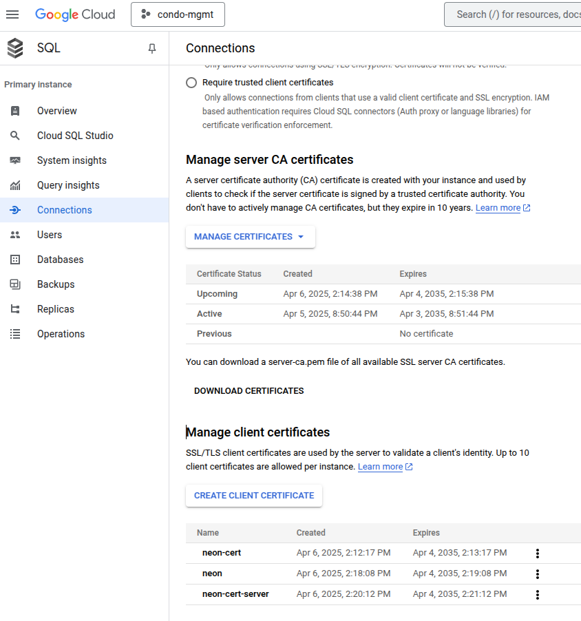

# Create SQL Gooble Cloud Access


### Command Access with psql

````
psql "sslmode=verify-ca sslrootcert=server-ca.pem sslcert=client-cert.pem sslkey=client-key.pem hostaddr=34.46.82.226 port=5432 user=postgres dbname=postgres"
````
The usage of psql requires :

- server-ca.pem
- client-cert.pem
- client-key.pem

The files are created from the SQL page of Google Cloud in the connections folder. 

* https://console.cloud.google.com/sql/instances/gloss-api-backend-postgres/connections/security?invt=AbuCwQ&project=condo-mgmt



### Overview of SQL Postgres Instance

````bash
https://console.cloud.google.com/sql/instances/gloss-api-backend-postgres/overview?invt=AbuCwQ&project=condo-mgmt
````

Generally the instance of the database can be created with a terraform file 

````bash
terraform {
  required_providers {
    google = {
      source  = "hashicorp/google"
      version = "~> 4.0"
    }
  }
}

provider "google" {
  project = "your-project-id"
  region  = "your-region"
}

resource "google_sql_database_instance" "default" {
  name         = "your-instance-name"
  database_version = "POSTGRES_14" # Or other supported version
  edition      = "ENTERPRISE_PLUS" # Or ENTERPRISE
  tier        = "db-m5-small" # Choose appropriate machine type
  region      = "your-region"
  deletion_protection = false

  settings {
    tier = "db-m5-small"
    database_flags = {
      log_min_duration_statement = "1000" # Log slow queries
    }
    backup_retention_period = "10" # Retention period in days
  }
}
````

## Explanation of Configuration

- **google_sql_database_instance**: This resource defines the Cloud SQL instance. 
- name: The name of your PostgreSQL instance.
- database_version: The PostgreSQL version to use (e.g., POSTGRES_14).
- edition: Choose either ENTERPRISE or ENTERPRISE_PLUS.
- tier: Specifies the machine type and performance tier (e.g., db-m5-small).
- region: The Google Cloud region where the instance will be created.
- settings: Allows configuring various instance settings, including:
- tier: (Duplicate, but allows overriding the global tier).
- database_flags: Set PostgreSQL flags (e.g., log_min_duration_statement for slow query logging).
- backup_retention_period: Configure the backup retention period in days.
- deletion_protection: Set to false to allow deletion of the instance.

After the database instance is created we need to create the connection as above.

The following command will describe all the environment variable of the SQL instance. The instance name is : gloss-api-backend-postgres.

````bash
gcloud sql instances describe gloss-api-backend-postgres
````
# Connection from Cloud Run

````bash
https://cloud.google.com/sql/docs/postgres/connect-run?hl=en
````


